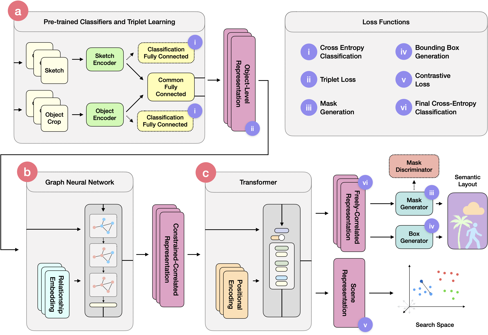

Scene Designer - Official Tensorflow 2.X Implementation
========================================================

  


This repository contains the official TensorFlow 2.X implementation of:

### Scene Designer: a Unified Model for Scene Search and Synthesis from Sketch
Leo Sampaio Ferraz Ribeiro (ICMC/USP), Tu Bui (CVSSP/University of Surrey), John Collomosse (CVSSP/University of Surrey and Adobe Research), Moacir Ponti (ICMC/USP)

> Abstract: Scene Designer is a novel method for searching and generating images using free-hand sketches of scene compositions; i.e. drawings that describe both the appearance and relative positions of objects. Our core contribution is a single unified model to learn both a cross-modal search embedding for matching sketched compositions to images, and an object embedding for layout synthesis. We show that a graph neural network (GNN) followed by Transformer under our novel contrastive learning setting is required to allow learning correlations between object type, appearance and arrangement, driving a mask generation module that synthesises coherent scene layouts, whilst also delivering state of the art sketch based visual search of scenes.

[](https://arxiv.org/abs/1234.56789) []()

## Table of contents
1. [Installing Requirements](#requirements)
1. [Preparing the QuickdrawCOCO-92c Dataset](#qdcoco)
2. [Preparing the SketchyCOCO dataset](#scoco)
3. [Training Stage 01](#stage01)
4. [Training Stage 02 and 03](#stage02)

<a name="qdcoco"></a>
## Preparing the QuickdrawCOCO-92c Dataset 

For each object in a COCO-stuff scene, we randomly select a QuickDraw sketch from the same class and replace the object crop. To do so, a map from QuickDraw classes to COCO classes was made. This map can be found in [quickdraw_to_coco_v2.json](prep_data/quickdraw/quickdraw_to_coco_v2.json) and on the Supplementary Material. Since QuickdrawCOCO-92c's sketch scenes are synthesised on the fly, we preprocess the original Quick Draw! into an indexed Tensorflow Dataset and preprocess COCO into a scene-graph annotated TF Dataset. 

### Downloading and Preprocessing Quick Draw!

The version used in the paper is the [Sketch-RNN QuickDraw Dataset](https://github.com/googlecreativelab/quickdraw-dataset#sketch-rnn-quickdraw-dataset). For our preprocessing script, download the per-class `.npz` files from [Google Cloud](https://console.cloud.google.com/storage/browser/quickdraw_dataset/sketchrnn).

We will need two TF Dataset versions. For the first stage of training we want a randomly ordered TF Dataset:
```bash
python -m prep_data.quickdraw_to_tfrecord --dataset-dir path/to/quickdraw/download \
                                          --target-dir path/to/save/quickdraw-tf
```

Then, for the second phase onwards, we want a class-indexed TF Dataset:

```bash
python -m prep_data.index_quickdrawtf --dataset-dir path/to/quickdraw/download \
                                      --target-dir path/to/save/quickdraw-indexed
```

These two versions were designed to improve the data loading bottleneck and RAM usage on all training stages.

### Downloading and Preprocessing COCO-stuff

We want to generate two TF datasets from COCO, (a) the complete scenes together with synthesised scene graph annotations and (b) an indexed set with object crops, to make them easy to load for our synthetic negative scenes (See Section 3.5 on the paper).

First, download all COCO-stuff files from the [Downloads Section](https://github.com/nightrome/cocostuff#downloads) in their official GitHub repo. Unzip the `.zip` files into the same directory. Now, to build (a) run the following script:

```bash
python -m prep_data.coco_to_tfrecord --dataset-dir path/to/coco-stuff \
                                     --target-dir /path/to/save/coco-graphs \
                                     --n-chunks 5 --val-size 1024
```

Note that you can change some of the parameters of this script, have a look at [coco_to_tfrecord.py](prep_data/coco_to_tfrecord.py) to see the default params for image size, mask size, filtering parameters, etc..

Finally, build (b) the indexed set of object crops with:

```bash
python -m prep_data.cococrops_to_tfrecord --dataset-dir path/to/coco-stuff \
                                          --target-dir /path/to/save/coco-crops
```

### Testing QuickDrawCOCO-92c

It's possible to test if the data was preprocessed correctly and the data loading speed by running the data loaders as scripts. Change the `default_hparams` on [qd_cc_tfrecord.py](dataloaders/qd_cc_tfrecord.py) and [coco_tfrecord.py](dataloaders/coco_tfrecord.py) to match the directories that you've just created and try running:

```bash
python -m dataloaders.qd_cc_tfrecord
```

to test if the `quickdraw-cococrops-tf` dataloader can load the crops and quickdraw sets. And run:

```bash
python -m dataloaders.coco_tfrecord
```

to check if the scene graphs, indexed quick draw and crops sets are all right.

## Preparing the SketchyCOCO Dataset <a name="scoco"></a>

Download SketchyCOCO from the [official GitHub Repo](https://github.com/sysu-imsl/SketchyCOCO#google-drive-hosting) and unzip the files into a common directory. Then run the script to create the TF Dataset: 

```bash
python -m prep_data.sketchycoco_to_tfrecord --dataset-dir path/to/coco-stuff \
                                            --target-dir /path/to/save/sketchycoco-tf \
                                            --sketchycoco-dir /path/to/sketchycoco
```

Notice that we use coco-stuff annotation that is not available with SketchyCOCO, so you have to specify the path to your previously downloaded COCO-stuff set as well, it will be filtered to match the SketchyCOCO set.

### Testing SketchyCOCO

As with QuickDrawCOCO-92c, it is possible to test if the dataloader is working by changing the `default_hparams` on [sketchycoco_tfrecord.py](dataloaders/sketchycoco_tfrecord.py) and running:

```bash
python -m dataloaders.sketchycoco_tfrecord
```

<a name="stage01"></a>
## Training Stage 01 


In the first stage of training, the Object-level Representation is trained independent of the model, using the dual triplet and cross-entropy loss. The input is a triple composed of (a, p, n), where a is a sketch, p is an object crop of the same class and n is an object crop of a different class. The ``quickdraw-cococrops-tf` dataloader (code [here](dataloaders/qd_cc_tfrecord.py)) takes care of making those triplets. To train we can use the following command:

```bash
python train.py multidomain-representation --data-loader quickdraw-cococrops-tf \
                                           -o /path/to/your/checkpoints/directory \
                                           --hparams learning_rate=1e-4 \
                                           --base-hparams batch_size=64,log_every=5,notify_every=20000,save_every=10000,safety_save=2000,iterations=100000,goal="First Stage of Scene Designer",slack_config='token.secret' \
                                           --data-hparams qdraw_dir='path/to/quickdraw-tf',crops_dir='/path/to/coco-crops'
                                           --gpu 0 --resume latest --id 01
```

Note how both `qdraw_dir` and `crops_dir` need to be specified with the TF Datasets created earlier. Keep your choice of `--id` in mind so that it can be loaded back in stage 02. The model type is `multidomain-representation`, which is implemented in (multidomain_classifier.py)[models/multidomain_classifier.py]. You can check which params are available to change by looking at the `python train.py --help-hps` output or directly in the model code.

During training and evaluation, plots of losses and evaluation metrics are saved every `notify_every` steps, these include classification accuracies and t-sne visualisations. These plots can be sent to slack as well if the user provides a file with the following format:

```
SLACK-BOT-TOKEN
slack_channel
```

And sets the `slack_config` parameter to the path to this file.

All training checkpoints and plots will be saved in `/path/to/your/checkpoints/directory/multidomain-representation-ID`. 

### Performance

This stage of training, with a batch size of 64, trains at an average of 0.14s/iteration on a single *Nvidia GeForce 2080 Ti*, taking around 4 hours to run the 100k iterations stated in the paper. It consumes 5GB of VRAM and 8GB of RAM on average on our hardware (Intel Core i9-7980XE, 128GB of DDR4 RAM).

<a name="stage02"></a>
## Training Stage 02 and 03 



Now these two stages should train the entire model, adding to what was learned in the first stage. The input to this stage is a collection of pairs of scenes, sketched and photographic, with scene graph annotations attached. Training follows the same principles as the previous stage, but with a different model id:

```bash
python train.py graph-attention --data-loader coco-tfrecord \
                                -o /path/to/your/checkpoints/directory \
                                --hparams learning_rate=1e-4,pt_mdomain_id='01' \
                                --data-hparams coco_dir='path/to/coco-graphs',crops_dir='/path/to/coco-crops',qdraw_dir='path/to/quickdraw-indexed' \
                                --base-hparams batch_size=16,log_every=5,notify_every=10000,save_every=10000,safety_save=50000,iterations=120000,goal='Train Stage 02',slack_config=token.secret \
                                --gpu 0 --resume latest --id SD01
```

Note how the stage 01 ID is used for the parameter `pt_mdomain_id`. Finally, after training for 120k iterations on this stage, change the dataset and train Stage 03, where the model is finetuned on the hard paired SketchyCOCO set for 5k iterations:

```bash
python train.py graph-attention --data-loader sketchycoco-tf \
                                -o /path/to/your/checkpoints/directory \
                                --hparams learning_rate=1e-4,pt_mdomain_id='01' \
                                --data-hparams sketchycoco_dir='path/to/sketchycoco-tf',crops_dir='/path/to/coco-crops' \
                                --base-hparams batch_size=16,log_every=5,notify_every=10000,save_every=10000,safety_save=50000,iterations=125000,goal='Train Stage 03',slack_config=token.secret \
                                --gpu 0 --resume latest --id SD01
```

The model plots losses every `notify_every` step and saves them on `/path/to/your/checkpoints/directory/ID/plots`.

### Performance

This stage of training, with a batch size of 16, trains at an average of 0.45s/iteration on a single *Nvidia GeForce 2080 Ti*, taking around 15 hours to run the 120k+5k iterations stated in the paper. It consumes 12GB of VRAM (all of a 2080 Ti) and 10GB of RAM on average on our hardware (Intel Core i9-7980XE, 128GB of DDR4 RAM).

## Evaluation <a name="evaluation"></a>

### Quick Metrics

The `evaluate-metrics.py` script follows most of the same rules as the `train.py` one. By using the same `--id` and `output_dir` (`-o`), the model will automatically read the hparams saved and rebuild the model. You need to specify the `--metrics` as a list of evaluation metrics the model can compute. The ones listed on the example below give a good overview of the training status.

Example:
```bash
python evaluate-metrics.py graph-attention \
    --data-loader sketchycoco-tf \
    -o /path/to/your/checkpoints/directory --id SD01 \
    --gpu 0 --resume /path/to/checkpoint \
    --metrics sbir-on-valid sbir-mAP sbir-top1 sbir-top10 sbir-top5 generated-masks
```

The `--resume` parameter can be either `none`, `latest` or a path. When using `latest`, make sure to use the same `--id` and `output_dir` that were used for training.

Note however that `evaluate-metrics.py` is meant to be used for quick evaluations and design decisions, so its metrics run on the validation set. 

### Experiments

The `run-experiment.py` script can be used to run proper experiments as presented in the paper. Each experiment is implemented in the [experiments](experiments) folder. For example, to run SBIR on all the test set, run the `extract-features` experiment to save the Scene Representation of all sketched and photographic scenes:

```bash
python run-experiment.py extract-features \
    --model-name graph-attention \
    --model-id SD01 \
    --data-loader sketchycoco-tf \
    --model-hparams sketchycoco_dir='path/to/sketchycoco-tf',crops_dir='/path/to/coco-crops'\
    -o /path/to/your/checkpoints/directory --id exp-sbir \
    --gpu 0 --resume /path/to/checkpoint \
    --exp-hparams results='path/to/save/features'
```

and then run `sbir-on-features-file` to run SBIR on all of those features and print out the results (and/or save the top retrieved images):

```bash
python run-experiment.py sbir-on-features-file \
    -o /path/to/your/checkpoints/directory --id exp-sbir \
    --gpu 0 --resume /path/to/checkpoint \
    --exp-hparams results='path/to/save/image/results',featsfile='path/where/you/saved/features/feats.npz'
```

### Generating Images

To generate images we can use the same `run-experiment.py` script, with the `generate-images` experiment:

```bash
python run-experiment.py generate-images \
    --model-name graph-attention \
    --model-id SD01 \
    --data-loader sketchycoco-tf \
    --model-hparams sketchycoco_dir='path/to/sketchycoco-tf',crops_dir='/path/to/coco-crops'\
    -o /path/to/your/checkpoints/directory --id exp-sbir \
    --gpu 0 --resume /path/to/checkpoint \
    --exp-hparams results='path/to/save/images'
```

#### Setting up the SPADE generator

Before running this image generation experiment, we should setup a SPADE model to generate the images from the layouts generated by Scene Designer. Since SPADE runs on pytorch and a different set of requirements, follow their [installation instructions](https://github.com/NVlabs/SPADE#installation), and install `flask` together with their requirements using `pip install flask`. Then, drop the [api.py](SPADE/api.py) file into the same folder as your SPADE clone and run it with:

```bash
python api.py
```

This is going to create a server that receives scene layouts and responds with generated images. Now the `generate-images` experiment should work as intended and generate images from all of the test set.


## Citation

This paper will be presented on the 1st Workshop on Sketching for Human Expressivity, at ICCV 2021

@InProceedings{SceneDesigner2021,
author = {Leo Sampaio Ferraz Ribeiro and Tu Bui and John Collomosse and Moacir Ponti},
title = {Scene Designer: a Unified Model for Scene Search and Synthesis from Sketch},
booktitle = {Proceedings of the IEEE/CVF International Conference on Computer Vision (ICCV) Workshops},
month = {Oct},
year = {2021}
}